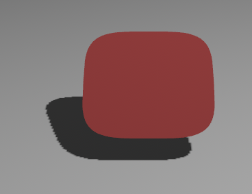
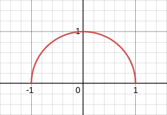
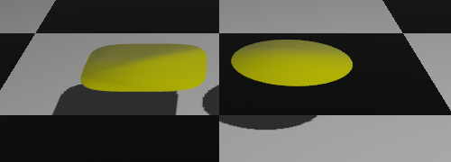
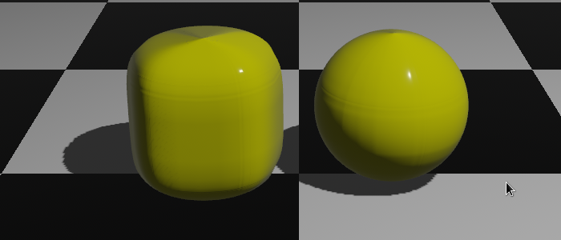

# bevy-single-variable-function-mesh

A 2D or 3D mesh (`bevy::render::mesh::Mesh`) generated from a
single-variable function `f(f32) -> f32`.

## Usage

Add this to your ```Cargo.toml```:

```
[dependencies]
bevy-single-variable-function-mesh = "0.2.1"
```

## Examples

We have one math function that generates a half squircle and one that
generates a half circle.

```
fn squircle(x: f32) -> f32 {
    (1.0 - (x).abs().powf(4.0)).powf(0.25)
}

fn circle(x: f32) -> f32 {
    (1.0 - x.powf(2.0)).powf(0.5)
}
```





```
bevy_single_variable_function_mesh::SingleVariableFunctionMesh {
    f: squircle, // Or circle.
    relative_height: 0.0,
	..default()
}
```



```
bevy_single_variable_function_mesh::SingleVariableFunctionMesh {
    f: squircle, // Or circle.
    relative_height: 0.2,
	..default()
}
```


```
bevy_single_variable_function_mesh::SingleVariableFunctionMesh {
    f: squircle, // Or circle.
    relative_height: 1.0,
	..default()
}
```



## Details

- This crate will automatically search for good vertices by comparing the slopes.
- The default function (`f`) is called "squircle" and not "half squircle" in favor of
short function names and because resulting mesh will be a full squircle.

## License

Licensed under either of these:

 * Apache License, Version 2.0, ([LICENSE-APACHE](LICENSE-APACHE) or
   https://www.apache.org/licenses/LICENSE-2.0)
 * MIT license ([LICENSE-MIT](LICENSE-MIT) or
   https://opensource.org/licenses/MIT)
