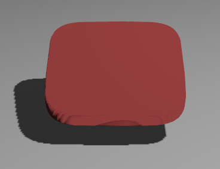

# bevy-single-variable-function-mesh

A 2D polygon or 3D mesh generated from a single-variable function `f(f32) -> f32`. In total, the mesh contains `vertices_polygon_upper_half` * `vertices_height` + 2 vertices.

## Usage

Add this to your ```Cargo.toml```:

```
[dependencies]
bevy-single-variable-function-mesh = "0.2.1"
```

And this to your .rs file.

```
use bevy_single_variable_function_mesh::SingleVariableFunctionMesh;
```

## Examples

<table>

<tr><th>Source code</th><th>Preview</th></td>

<tr>
<td>
<pre>
fn squircle(x: f32) -> f32 {
    (1.0 - (x).abs().powf(4.0)).powf(0.25)
}
</pre>
<pre>
let mesh: Mesh = SingleVariableFunctionMesh {
    f: squircle,
    x_start: -1.0,
    x_end: 1.0,
    relative_depth: 0.0,
    vertices_per_side: 30,
    vertices_thickness: 1,
};
</pre>
</td>
<td></td>
</tr>

<tr>
<td>
<pre>
let mesh: Mesh = SingleVariableFunctionMesh {
    f: squircle,
    x_start: -1.0,
    x_end: 1.0,
    relative_depth: 0.2,
    vertices_per_side: 30,
    vertices_thickness: 20,
};
</pre>
</td>
<td></td>
</tr>

</table>

## License

Licensed under either of these:

 * Apache License, Version 2.0, ([LICENSE-APACHE](LICENSE-APACHE) or
   https://www.apache.org/licenses/LICENSE-2.0)
 * MIT license ([LICENSE-MIT](LICENSE-MIT) or
   https://opensource.org/licenses/MIT)
