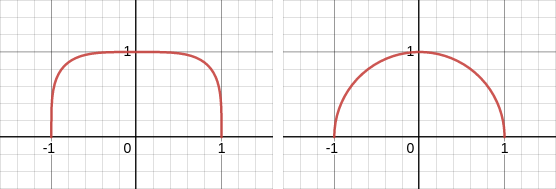
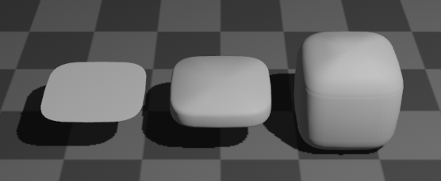
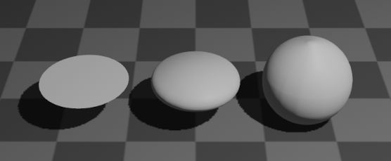

# bevy-single-variable-function-mesh

[](https://opensource.org/licenses/MIT)
[](https://docs.rs/bevy-single-variable-function-mesh)
[](https://crates.io/crates/bevy-single-variable-function-mesh)
[](https://github.com/bevyengine/bevy/blob/main/docs/plugins_guidelines.md#main-branch-tracking)

A 2D or 3D mesh (`bevy::render::mesh::Mesh`) generated from a
single-variable function `f(f32) -> f32`.

## Examples

We have one math function that generates a half squircle and one that
generates a half circle.

```
fn squircle(x: f32) -> f32 {
    (1.0 - (x).abs().powf(4.0)).powf(0.25)
}

fn circle(x: f32) -> f32 {
    (1.0 - x.powf(2.0)).powf(0.5)
}
```



```
commands.spawn(PbrBundle {
    mesh: meshes.add(
        SingleVariableFunctionMesh {
            f: squircle, // or circle
            relative_height: 0.0,
            ..default()
        }
        .into(),
    ),
    material: materials.add(StandardMaterial::default()),
    transform: Transform::from_xyz(-2.5, 1.0, 0.0),
    ..default()
});
commands.spawn(PbrBundle {
    mesh: meshes.add(
        SingleVariableFunctionMesh {
            f: squircle, // or circle
            relative_height: 0.2,
            ..default()
        }
        .into(),
    ),
    material: materials.add(StandardMaterial::default()),
    transform: Transform::from_xyz(0.0, 1.0, 0.0),
    ..default()
});
commands.spawn(PbrBundle {
    mesh: meshes.add(
        SingleVariableFunctionMesh {
            f: squircle, // or circle
            relative_height: 1.0,
            ..default()
        }
        .into(),
    ),
    material: materials.add(StandardMaterial::default()),
    transform: Transform::from_xyz(2.5, 1.0, 0.0),
    ..default()
});
```




## Details

- Feel free to add ideas to the bug tracker.
- This crate will automatically search for good vertices by comparing the slopes
of the input function called `f`.
- The plane in the render scene was created by ```f: |_x: f32| -> f32 { 20.0 },```.

## Compatible Bevy Version

| bevy  | bevy-single-variable-function-mesh |
|-------|------------------------------------|
| 0.11  | 0.11                               |

## License

Licensed under either of these:

 * Apache License, Version 2.0, ([LICENSE-APACHE](LICENSE-APACHE) or
   https://www.apache.org/licenses/LICENSE-2.0)
 * MIT license ([LICENSE-MIT](LICENSE-MIT) or
   https://opensource.org/licenses/MIT)

## Contribution

Unless you explicitly state otherwise, any contribution intentionally submitted for inclusion in the work by you, as defined in the Apache-2.0 license, shall be dual licensed as above, without any additional terms or conditions.
