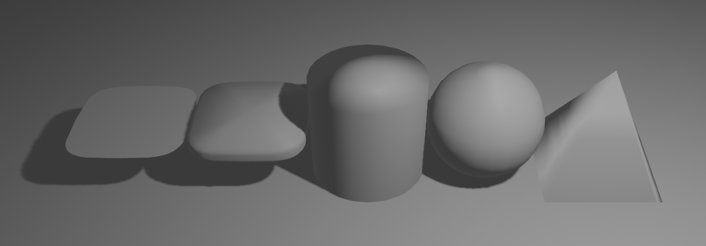

[](https://opensource.org/licenses/MIT)
[](https://docs.rs/bevy-single-variable-function-mesh)
[](https://crates.io/crates/bevy-single-variable-function-mesh)

## What is bevy-single-variable-function-mesh?

A 2D or 3D mesh generated from single-variable functions.

## Examples

We have one math function that generates a half squircle and one that
generates a half circle.

```rust
fn squircle(x: f32) -> f32 {
    (1.0 - (x).abs().powf(4.0)).powf(0.25)
}

fn circle(x: f32) -> f32 {
    (1.0 - x.powf(2.0)).powf(0.5)
}
```


```rust
// Flat ground.
commands.spawn((
    Mesh3d(meshes.add(SingleVariableFunctionMesh {
        f1: |_x: f32| -> f32 { 10.0 },
        f1_x_start: -10.0,
        f1_x_end: 10.0,
        f2_x_start: 0.0,
        f2_x_end: 0.0,
        ..default()
    })),
    MeshMaterial3d(materials.add(StandardMaterial::default())),
    Transform::from_xyz(0.0, 0.0, 0.0),
));

// Flat squircle.
commands.spawn((
    Mesh3d(meshes.add(SingleVariableFunctionMesh {
        f1: squircle,
        f2_x_start: 0.0,
        f2_x_end: 0.0,
        ..default()
    })),
    MeshMaterial3d(materials.add(StandardMaterial::default())),
    Transform::from_xyz(-4.0, 1.0, 0.0),
));

// A bit flat squircle.
commands.spawn((
    Mesh3d(meshes.add(SingleVariableFunctionMesh {
        f1: squircle,
        f2: |x: f32| -> f32 { (1.0 - (x * 5.0).abs().powf(4.0)).powf(0.25) },
        f2_x_start: -0.2,
        f2_x_end: 0.2,
        ..default()
    })),
    MeshMaterial3d(materials.add(StandardMaterial::default())),
    Transform::from_xyz(-2.0, 1.0, 0.0),
));

// Cylinder.
commands.spawn((
    Mesh3d(meshes.add(SingleVariableFunctionMesh {
        f1: circle,
        f2: straight,
        ..default()
    })),
    MeshMaterial3d(materials.add(StandardMaterial::default())),
    Transform::from_xyz(0.0, 1.0, 0.0),
));

// Ball.
commands.spawn((
    Mesh3d(meshes.add(SingleVariableFunctionMesh {
        f1: circle,
        f2: circle,
        ..default()
    })),
    MeshMaterial3d(materials.add(StandardMaterial::default())),
    Transform::from_xyz(2.0, 1.0, 0.0),
));

// Pyramid.
commands.spawn((
    Mesh3d(meshes.add(SingleVariableFunctionMesh {
        f2: |x: f32| -> f32 { -0.5 * x + 0.5 },
        ..default()
    })),
    MeshMaterial3d(materials.add(StandardMaterial::default())),
    Transform::from_xyz(4.0, 1.0, 0.0),
));
```



## Details

- This crate will automatically search for good vertices by comparing the slopes
of the input functions.
- In the future releases, the UV mapping might change.

## Compatible Bevy Version

| bevy  | bevy-single-variable-function-mesh |
|-------|------------------------------------|
| 0.17  | 0.17                               |
| 0.16  | 0.16                               |
| 0.15  | 0.15                               |
| ...   | ...                                |
| 0.13  | 0.13                               |
| 0.12  | 0.12                               |
| 0.11  | 0.11                               |

## License

Licensed under either of these:

 * Apache License, Version 2.0, ([LICENSE-APACHE](LICENSE-APACHE) or
   https://www.apache.org/licenses/LICENSE-2.0)
 * MIT license ([LICENSE-MIT](LICENSE-MIT) or
   https://opensource.org/licenses/MIT)

## Contribution

Unless you explicitly state otherwise, any contribution intentionally submitted for inclusion in the work by you, as defined in the Apache-2.0 license, shall be dual licensed as above, without any additional terms or conditions.
